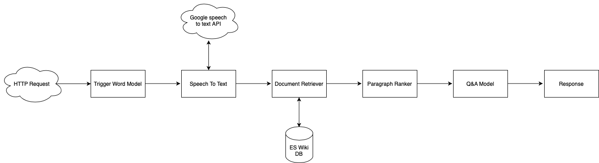
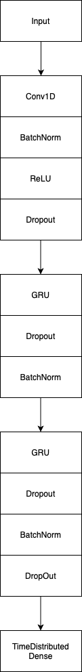

# Jarvis

Jarvis is a simple version of Alexa/Siri that can answer factual questions (ie "Hey Jarvis, when was Michael Jordan born?"). Here's how an overall architecture looks like:

Two main ML algorithms that help Jarvis answer a question are a trigger word model and a q&a model.

## Trigger Word Model

Trigger word model is a GRU network that was trained a custom dataset that I created. Once Jarvis is out of beta I'll post a link to the dataset.

## Q & A Model

Originally I fined tuned a BERT model on a SQUAD 2.0 dataset but then I found an ALBERT model that was already trained on that dataset on hugging face so I ended up using that instead (ALBERT model had better perfomance). Here's the link to the model: https://huggingface.co/ktrapeznikov/albert-xlarge-v2-squad-v2

## How can I use it?

Jarvis was tested by a handful of people and I've gotten a lot of good feedback. I'm currently working on making it better and hopefully releasing a private beta in the next few months.
